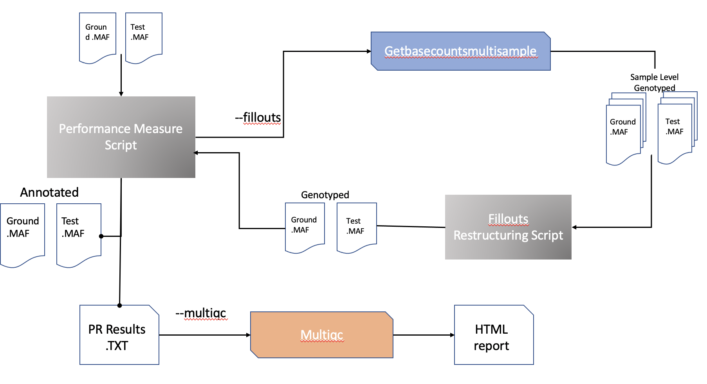

# Performance Measure Metrics
This tool is meant to calculate performance metrics on different slices of the input data. The tool expected 2 MAF files as the input to compare recall and precision between the two. The results are then subsectioned based on annotations for a clearer picture. If the FILLOUTS flag is specified, the tool will run metrics on both the CALLED (or original MAF file) and the resulting genotyped MAF files. 

NOTE: This analysis must be run on JUNO if utilizing genotyping or HTML report generation/multiqc.

## Pipeline Flowchart
<p align="center">
  
</p>


## Arguments for performance_measure_script.R
### Required
#### Basic Analysis

Choice of ground and test files determines your recall and precision metrics. Your ground file is assumped to be absolute truth; for the sake of accurate comparison of recall and precision, some variables in the test file will be set the the ground file's values. To see the variables that are compared, check the resulting annotated file.

```
-g/ --ground			Path to cohort ground .MAF file
-t/ --test			Path to cohort test .MAF file
```
#### Genotyping
```
-f/ --fillouts 			[Providing flag activates genotyping]
-r/ --ground_fillout_mapping	Path to ground tumor/normal BAM mapping .TXT file. See helper script below.
-e/ --test_fillout_mapping	Path to test tumor/normal BAM mapping .TXT file. See helper script below.
```

### Optional
```
-d/ --directory			Save results to this directory. Default is working directory
-n/ --name_ground		Name of ground cohort
-s/ --name_test			Name of test cohort
-o/ --out_prefix		Out prefix. Default is Sys.time: %Y_%M_%D_%h:%m:%s_
-b/ --bed_file			Path to target .BED file. Activated on target analysis. See [description](./docs/description) for more information.
-m/ --multiqc			  [Providing flag acivates generation of a HTML report]
-v/ --additional_variables      A single or comma-seperated list of additional variables to calculate metrics on. These variables MUST be already in your .MAF files and be catagorical.
```

## Examples
Note: Runs on JUNO should be run with a scheduler. There are embedded bsubs for fillouts and multiqc runs. 

### Basic Run:

`Rscript performance_measure_script.R --test test.maf --ground  ground.maf -n DRAGEN -s TEMPO -d base_run_dir_0`

#### Generate HTML report
`Rscript performance_measure_script.R --test test.maf --ground  ground.maf -n DRAGEN -s TEMPO -d base_mqc_run_dir_0 -m`

### Genotyping Run:

`Rscript performance_measure_script.R -t test.maf -g ground.maf -n DRAGEN -s TEMPO -f --ground_fillout_mapping ground_bam_mapping_for_fillouts.txt --test_fillout_mapping test_bam_mapping_for_fillouts.txt -d fillouts_run_dir_0  `

### On Target + Genotyping Run:

`Rscript performance_measure_script.R -t test.maf -g ground.maf -n DRAGEN -s TEMPO -f -r ground_bam_mapping_for_fillouts.txt -e test_bam_mapping_for_fillouts.txt -b IMPACT468_b37.bed -d fillouts_mqc_bed_run_dir_0`


### Helper Script
[making_fillouts_mapping_file.R](./making_fillouts_mapping_file.R) 
This script can help generate a TXT mapping file. Provide the directory containing the test OR ground BAMs, a TXT file with the Tumor - Normal Pair (expected header TUMOR_ID \t NORMAL_ID), and the name of the output file. 

`Rscript  making_fillouts_mapping_file.R --bam_dir /juno/work/tempo/wes_repo/Results/v1.4.x/cohort_level/CCS_NFCXOZVP/bams/ --mapping example_inputs/CCS_NFCXOZVP.cohort.txt --output_file example_inputs/CCS_bam_mapping_for_fillouts.txt`

Sym links are not functional when genotyping. 

## Required R packages
- dplyr
- data.table
- stringr
- jsonlite
- binom
- ggplot2
- ggpubr
- ggsci
- tidyverse
- tidyr
- argparse
- doParallel
- cowplot
- grid
- gridExtra

If running on target analysis:
- bedR
